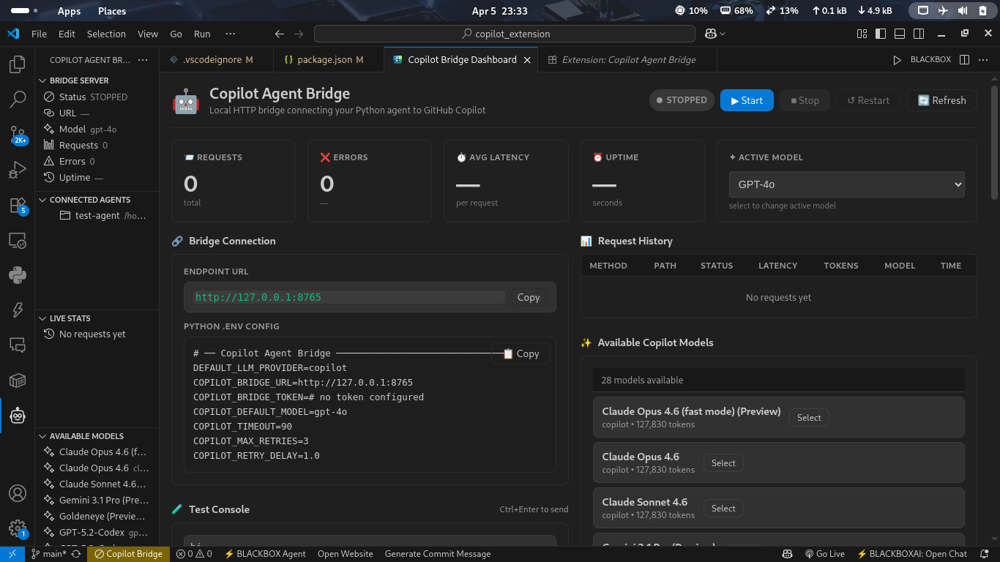
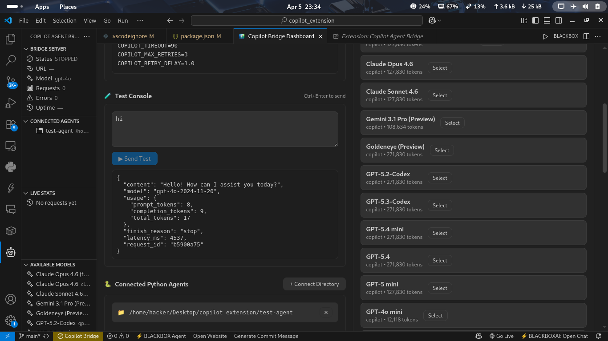

# 🧠 Copilot Agent Bridge

<p align="center">
  <b>Connect your Python AI agents to GitHub Copilot with a powerful local bridge inside VS Code</b>
</p>

<p align="center">
  
  
  
  
</p>

---

## ✨ Overview

**Copilot Agent Bridge** unlocks the full power of GitHub Copilot by allowing your external AI systems (like Python agents) to communicate with it via a local HTTP server.

Build advanced AI workflows, automate coding tasks, and create intelligent developer tools beyond the VS Code UI.

---

## 📸 Screenshots

### 🔹 Dashboard (Live Monitoring)



### 🔹 Sidebar (Quick Controls)



---

## 🚀 Features

### 🔗 Local HTTP Bridge

Run a secure local server to connect Python agents or external tools directly to Copilot.

### 🤖 Multi-Model Support

Access powerful models:

* `gpt-4o`
* `gpt-4`
* `o1`
* `o3-mini`

### 📊 Real-Time Dashboard

Track:

* Request latency
* Token usage
* Errors
* Live activity

### 📁 Agent Management

Connect and manage multiple AI agent directories seamlessly.

### 🧪 Built-in Testing

Test prompts directly inside VS Code before integrating into your agent.

### 📜 Request Logging

Full request/response history with debugging support.

### ⚙️ Advanced Configuration

Customize:

* Port & host
* Timeout settings
* Authentication tokens
* Default AI model

---

## 🛠️ How It Works

```text
Python Agent → HTTP Request → VS Code Extension → GitHub Copilot → Response → Agent
```

1. Start the bridge server
2. Send request from your AI agent
3. Extension forwards it to Copilot
4. Response is returned instantly

---

## ⚡ Quick Start

### 1️⃣ Start the Bridge

```bash
Ctrl + Shift + P → "Copilot Bridge: Start Bridge Server"
```

---

### 2️⃣ Configure Your Agent

```env
COPILOT_BRIDGE_URL=http://127.0.0.1:8765
```

---

### 3️⃣ Send a Request

```json
POST /chat
{
  "message": "Explain recursion simply"
}
```

---

## 🔌 Use Cases

* 🤖 Build custom AI coding assistants
* 🔄 Automate development workflows
* 🧠 Create autonomous AI agents
* 🧪 Experiment with LLM pipelines
* 🛠️ Build developer tools powered by Copilot

---

## 🔐 Security

* Runs locally (`127.0.0.1`)
* Optional Bearer token authentication
* No external API exposure
* Full local control

---

## 📦 Installation

### 🔹 From VS Code Marketplace

Search: **Copilot Agent Bridge**

---

### 🔹 Manual Installation

1. Download `.vsix`
2. Open VS Code
3. Extensions → `...` → Install from VSIX

---

## 📌 Requirements

* VS Code 1.80+
* GitHub Copilot enabled
* Active Copilot subscription

---

## 💡 Why Use Copilot Agent Bridge?

GitHub Copilot is powerful — but limited to editor interactions.

This extension lets you:

✔ Build AI systems around Copilot
✔ Automate repetitive coding tasks
✔ Extend Copilot into APIs
✔ Integrate with external tools
✔ Create next-gen developer workflows

---

## 🧪 Development Setup

```bash
git clone https://github.com/Rishavdes/copilot-agent-bridge.git
cd copilot-agent-bridge
npm install
npm run package
```

---

## 📈 SEO Keywords

copilot, vscode extension, ai agent, python ai, gpt-4o, automation, llm, developer tools, copilot api, ai workflow, coding assistant

---

## 🤝 Contributing

Contributions are welcome!

* 🐛 Report bugs
* 💡 Suggest features
* 🔧 Submit pull requests

---

## 📄 License

MIT License

---

## ⭐ Support

If you like this project:

* ⭐ Star the repository
* 🔁 Share with others
* 🧠 Build amazing AI tools

---

<p align="center">
  🚀 Build smarter AI workflows with Copilot Agent Bridge
</p>
